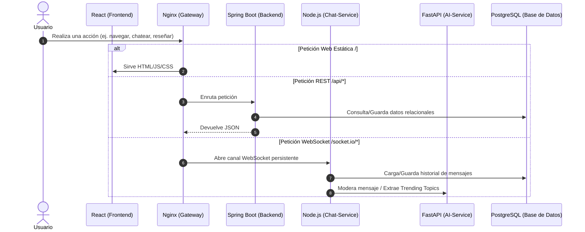
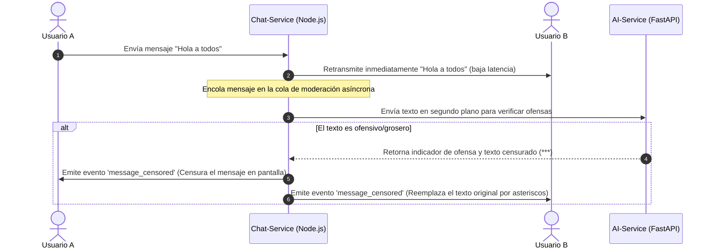

# Guía Explicativa: Comprensión Profunda del Proyecto

Esta guía está diseñada para que entiendas **a la perfección** cómo funciona este proyecto por dentro, la lógica de sus componentes, las decisiones de diseño y cómo interactúan los servicios. No es solo un mapa de carpetas, sino una explicación conceptual detallada.

---

## 1. El Concepto y Propósito del Proyecto

El proyecto es una **red social para entusiastas de los videojuegos** que integra:
1.  **Catálogo interactivo**: Búsqueda, filtros y visualización de videojuegos (datos reales obtenidos de la API internacional IGDB).
2.  **Red Social**: Relaciones de amistad, seguidores, feed de actividad de amigos, notificaciones y perfiles de usuario.
3.  **Salas de Chat en Vivo y Mensajes Privados**: Comunicación en tiempo real dentro de comunidades dedicadas a cada juego y chats directos entre usuarios.
4.  **Motor de Recomendaciones Inteligentes (IA)**: Sugerencias de juegos similares, recomendaciones personalizadas de videojuegos y sugerencias de amigos con intereses afines.

---

## 2. Entendiendo el Ecosistema de Microservicios

El sistema está dividido en piezas independientes que se comunican mediante APIs REST y WebSockets en una red virtual de Docker:



### ¿Por qué esta arquitectura?
*   **Escalabilidad**: El motor de IA (Python) consume mucha CPU y memoria al cargar los modelos de lenguaje. Al estar separado del Backend (Java) y del Chat (Node.js), podemos escalar cada contenedor según sus necesidades específicas sin que uno afecte al rendimiento del otro.
*   **Especialización de tecnologías**:
    *   **Java/Spring Boot** es ideal para lógica de negocio robusta, seguridad empresarial y transacciones de base de datos seguras.
    *   **Node.js** es extremadamente rápido y eficiente para conexiones concurrentes masivas (WebSockets en tiempo real).
    *   **Python (FastAPI)** es el estándar indiscutible para cargar librerías de Inteligencia Artificial (PyTorch, Transformers, NLP).

---

## 3. El Cerebro del Sistema: pgvector y Recomendaciones por IA

Para entender la inteligencia artificial del proyecto, hay que comprender el concepto de **Vectorización (Embeddings)** y **Búsquedas Espaciales**.

### A. ¿Qué es un Vector (Embedding) en el contexto de videojuegos?
La descripción de un videojuego (ej. *"Un RPG de acción postapocalíptico con robots y exploración de mundo abierto"*) es texto libre. Una máquina no puede comparar textos fácilmente para saber si se parecen. 
Para solucionarlo, el **AI-Service** utiliza un modelo de lenguaje pre-entrenado llamado `all-MiniLM-L6-v2`. Este modelo convierte cualquier texto descriptivo en una lista fija de **384 números reales (un vector)**. 
*   Juegos temáticamente similares tendrán vectores con valores numéricos muy parecidos.
*   Juegos diferentes tendrán vectores muy distantes.

### B. ¿Cómo funciona la recomendación en la Base de Datos?
En lugar de procesar los vectores en memoria de forma ineficiente, utilizamos la extensión **pgvector** directamente en PostgreSQL.
1.  Los 384 números de cada juego se guardan en la columna `embedding` de tipo `vector(384)`.
2.  Para buscar juegos similares al juego actual, el sistema ejecuta una consulta en la base de datos calculando la **Distancia Coseno** entre el vector del juego de referencia y los demás juegos.
3.  El motor de base de datos ordena los resultados de menor a mayor distancia (los más cercanos geométricamente son los más similares). Para acelerar esto, se utiliza un índice de tipo **HNSW (Hierarchical Navigable Small World)**, que estructura los vectores en un grafo multidimensional para realizar búsquedas instantáneas sin escanear toda la tabla.

### C. Generación de Gustos del Usuario
1.  Cuando un usuario califica positivamente juegos (nota > 7), el sistema obtiene los vectores (embeddings) de esos juegos.
2.  El AI-Service calcula el **promedio matemático** de estos vectores. El vector resultante representa de forma numérica el "gusto promedio" del usuario en el espacio multidimensional.
3.  **Recomendación de juegos**: Se buscan en la base de datos los juegos más cercanos a ese vector promedio de gustos del usuario, excluyendo los que ya ha jugado/reseñado.
4.  **Recomendación de amigos**: Comparamos el vector de gustos del usuario A con el vector de gustos del usuario B. Si la distancia coseno es muy baja, significa que tienen gustos de videojuegos sumamente afines y el sistema los sugiere como amigos.

### D. Análisis de Sentimientos
Cuando visitas la ficha de un juego, el AI-Service toma las reseñas escritas de ese título y las procesa con un modelo clasificador de lenguaje (`twitter-roberta-base-sentiment`). Analiza el tono de cada comentario y clasifica de forma agregada el sentimiento general del juego en: **Positivo, Neutral o Negativo**.

---

## 4. El Canal de Comunicación: Chat en Tiempo Real y Moderación Activa

El servicio de chat (`chat-service`) proporciona interactividad instantánea empleando WebSockets bidireccionales, complementado con procesos en segundo plano.

### A. El Ciclo de Envío y Moderación Asíncrona de Mensajes
Para garantizar una experiencia fluida sin retrasos al enviar mensajes, el sistema implementa una **moderación asíncrona**:



1.  **Envío**: El usuario escribe un mensaje en la sala de chat.
2.  **Difusión Inmediata**: El servidor de chat recibe el mensaje y lo distribuye al instante a todos los usuarios conectados en la sala (latencia casi cero).
3.  **Persistencia**: El mensaje se guarda de forma asíncrona en la base de datos de PostgreSQL en la tabla `chat_messages`.
4.  **Encolamiento**: El chat agrega el mensaje a una **cola de moderación interna en memoria** (`moderationQueue`) gestionada por un hilo de trabajo (`Worker`) continuo.
5.  **Verificación de groserías**: El hilo consume la cola enviando peticiones HTTP al servicio de IA (`/social/moderation/check`).
6.  **Censura retroactiva**: Si la IA dictamina que el mensaje contiene lenguaje ofensivo, el servicio de chat emite un evento especial de Socket.io (`message_censored`) a toda la sala. Los clientes de React capturan este evento y reemplazan instantáneamente el texto ofensivo por su versión censurada (con asteriscos) en la pantalla de todos los usuarios de forma dinámica.

### B. Palabras Tendencia (Trending Topics)
Para mostrar los temas de interés en cada chat, el chat-service mantiene una ventana de los últimos 200 mensajes de cada sala. Periódicamente, envía este bloque al servicio de IA, que utiliza un algoritmo **TF-IDF** (Term Frequency - Inverse Document Frequency) para identificar los términos significativos más repetidos (filtrando preposiciones y palabras vacías) y devolver el listado de tendencias a la barra lateral del chat.

---

## 5. La Robustez del Backend: Spring Boot

El Backend gestiona las reglas y la protección de datos con altos estándares:

### A. Autenticación JWT de Doble Token
La seguridad no se almacena en el servidor (es *stateless*). Se basa en fichas firmadas criptográficamente:
*   **Access Token (Token de acceso)**: Token de corta duración (ej. 15 minutos). Se inyecta en cada cabecera HTTP (`Authorization: Bearer <token>`). Si es interceptado, caduca pronto.
*   **Refresh Token (Token de refresco)**: Guardado de forma segura y persistente en la base de datos. Sirve para pedir un nuevo Access Token cuando este expira, sin obligar al usuario a introducir sus credenciales de nuevo.

### B. Evitando Inconsistencias: Bloqueo Concurrente en Reseñas
Un problema común en aplicaciones web es que si 100 usuarios escriben una reseña para el mismo juego exactamente al mismo tiempo, el cálculo del promedio de notas del juego (`avg_score`) puede corromperse por escrituras simultáneas (condición de carrera).
Para evitarlo, el [ReviewService.java](file:///c:/Users/raulg/OneDrive/Escritorio/Proyecto/backend/src/main/java/com/app/service/ReviewService.java) implementa un **mecanismo de bloqueo y cálculo aislado** en base de datos al guardar o borrar una reseña. Esto garantiza que cada reseña actualice el promedio de manera secuencial y exacta.

### C. Limitador de Tasa (Rate Limiting)
Para prevenir ataques de denegación de servicio (DoS) o scripts maliciosos que intenten saturar la base de datos registrando miles de cuentas o enviando peticiones repetitivas, el sistema aplica [RateLimitFilter.java](file:///c:/Users/raulg/OneDrive/Escritorio/Proyecto/backend/src/main/java/com/app/security/RateLimitFilter.java).
*   Utiliza la librería **Bucket4j**.
*   Asigna un "cubo virtual" de fichas a cada dirección IP. Cada petición consume una ficha. Si el cubo se vacía, el servidor rechaza las siguientes peticiones inmediatamente con el código de estado HTTP `429 Too Many Requests` hasta que el cubo se vuelva a llenar automáticamente con el tiempo.

---

## 6. Frontend: React, React Query y Axios

El Frontend maneja la presentación y la consistencia de estado en el cliente de la siguiente forma:

*   **Enrutador SPA**: Utiliza `react-router-dom` para navegar entre páginas instantáneamente sin recargar la web entera.
*   **Axios e Interceptores**: En [axios.ts](file:///c:/Users/raulg/OneDrive/Escritorio/Proyecto/frontend/src/api/axios.ts) hay un interceptor configurado. Cada vez que el frontend hace una llamada HTTP a cualquier endpoint del backend, el interceptor toma el token JWT guardado en el navegador y lo inyecta automáticamente en la cabecera `Authorization`. Si el servidor responde que el token ha expirado, el interceptor intenta obtener otro de forma automática usando el Refresh Token antes de fallar.
*   **Contextos Globales**: Comparten información viva que necesitan muchas pantallas a la vez:
    *   `AuthContext`: Mantiene el usuario logueado.
    *   `NotificationContext`: Escucha eventos globales para mostrar globos de alerta (ej. "Tienes una nueva solicitud de amistad").
    *   `CommunityContext`: Almacena las salas unidas y el estado de los chats.

---

## 7. Problemas de Compilación Corregidos en el Backend

Durante la fase de compilación del microservicio de backend en entornos rigurosos, se detectaron fallos críticos de compilación en los archivos [CommunityService.java](file:///c:/Users/raulg/OneDrive/Escritorio/Proyecto/backend/src/main/java/com/app/service/CommunityService.java) y [GameController.java](file:///c:/Users/raulg/OneDrive/Escritorio/Proyecto/backend/src/main/java/com/app/controller/GameController.java):

```text
[ERROR] CommunityService.java: local variables referenced from a lambda expression must be final or effectively final
[ERROR] GameController.java: local variables referenced from a lambda expression must be final or effectively final
```

### Origen del problema:
En ambos archivos se declaraba una variable `currentUser` inicializada a través de un operador ternario que incluía expresiones lambda internas (`orElseGet(() -> ...)` en `CommunityService`, y `or(() -> ...)` de Java 9+ en `GameController`). 

Debido a un comportamiento bug conocido en el compilador de Java (`javac`), al inicializar una variable local `final` mediante una expresión que contiene lambdas en su interior, el compilador falla al verificar el alcance y erróneamente marca la variable como "no efectivamente final" para las lambdas subsiguientes (como la del Stream en `getCommunities` o la de `Optional.map` en `getGameById`). Esto bloqueaba la construcción del backend.

### Solución aplicada:
Se reestructuraron las asignaciones de la variable en ambos archivos de la siguiente manera:
1. Se definió una variable temporal mutable `User tempUser = null;`.
2. Se empleó una estructura lógica `if` en lugar del operador ternario para realizar la búsqueda y asignación sobre `tempUser`.
3. Finalmente, se inicializó la variable final a partir de la temporal: `final User currentUser = tempUser;`.

Esta asignación directa libre de lambdas anidadas en el inicializador resolvió el problema del compilador de raíz, permitiendo compilar y empaquetar el microservicio de backend con éxito en todos los entornos.

---

## 8. Mapa y Estructura de Archivos del Proyecto

Esta sección detalla dónde reside cada componente clave para que puedas navegar por el código fuente sin perderte.

### 📁 Raíz del Proyecto
*   `docker-compose.yml`: Orquestador global. Define cómo se levantan y conectan en red todos los contenedores (Frontend, Gateway, Backend, AI-Service, Chat-Service y BD).
*   `generate_100_games.py`: Script de utilidad en Python que inyecta datos de prueba realistas (juegos, descripciones y vectores de prueba) en la base de datos para facilitar el desarrollo inicial sin tener que introducirlos a mano.
*   `explicacion.md`: Este mismo archivo, el documento maestro para comprender la arquitectura y los conceptos del ecosistema.

### 📁 `api-gateway/` (Nginx)
Punto de entrada único. Todo el tráfico externo del usuario pasa por aquí antes de llegar a los microservicios, lo que unifica el dominio y soluciona problemas de CORS.
*   `nginx.conf` (y similares): Define las reglas de enrutamiento proxy inverso (ej. peticiones a `/api/` van a Spring Boot, `/socket.io/` van al servicio de chat, y la ruta raíz `/` sirve la interfaz web frontend compilada).

### 📁 `backend/` (Spring Boot / Java 21)
El núcleo de la lógica empresarial relacional, transaccional y la seguridad (Validaciones, CRUD de Base de Datos).
*   `pom.xml`: Define las dependencias de Maven empleadas (Lombok, Spring Security, Spring Data JPA, Hibernate Vector para pgvector, Bucket4j).
*   `src/main/java/com/app/controller/`: Los controladores REST, las puertas de entrada al backend (ej. `GameController.java` para filtros y catálogo, `SocialController.java` para el ecosistema de amistades).
*   `src/main/java/com/app/service/`: Lógica de negocio pesada, algoritmos de cálculo (ej. `ReviewService.java` que gestiona el cálculo concurrente y atómico de puntuaciones de juegos).
*   `src/main/java/com/app/model/`: Entidades JPA que mapean exactamente las clases de Java con las tablas y columnas relacionales de PostgreSQL (ej. `Game.java`, `User.java`, `Review.java`).
*   `src/main/java/com/app/security/`: Lógica de Autenticación de usuarios por JWT (`JwtTokenProvider.java`), lectura de contexto y el filtro `RateLimitFilter.java` para mitigar ataques masivos DDoS.
*   `src/main/resources/db/migration/`: Scripts versionados de Flyway (SQL). Sirven para crear y alterar automáticamente el esquema de la base de datos relacional paso a paso al arrancar el backend por primera vez.

### 📁 `chat-service/` (Node.js)
Motor especializado exclusivo para la comunicación WebSocket en tiempo real de los canales de comunidad.
*   `package.json`: Gestor de dependencias (Socket.io para comunicación en tiempo real, Axios, pg).
*   Archivos base de lógica: Suelen contener el servidor WebSocket que captura los eventos del cliente de retransmitir mensajes y conectarse a salas, así como las colas en memoria que mandan a revisar textos asincrónicamente al servicio de IA.

### 📁 `ai-service/` (Python / FastAPI)
El cerebro matemático del sistema. Encargado de transformar texto de lenguaje natural en vectores embebidos (embeddings) y análisis predictivo.
*   API y Lógica: Controladores de FastAPI que exponen los endpoints internos para el resto del cluster docker (`/games/{id}/sentiment` llamado por Java, `/social/moderation/check` llamado por Node.js).
*   Modelos de Lenguaje: Scripts que se conectan a HuggingFace o usan librerías como `sentence-transformers` para procesar inferencias de Inteligencia Artificial (similitud semántica y toxicidad) consumiendo un alto grado de procesamiento en su propio entorno aislado.

### 📁 `frontend/` (React + Vite + TypeScript)
La cara visible e interactiva de la plataforma donde el usuario navega.
*   `vite.config.ts`: Configuración súper rápida del bundler de desarrollo y compilación a estáticos para producción.
*   `src/api/axios.ts`: Archivo crítico donde radican los interceptores de red HTTP. Inyecta silenciosamente los tokens JWT de autorización y es capaz de interceptar respuestas "401 Expired" para pedir automáticamente un nuevo Refresh Token y reintentar la llamada sin desloguear al usuario.
*   `src/components/`: Bloques de interfaz de usuario desacoplados y modulares (Barra lateral, Tarjetas dinámicas de videojuegos, Modales).
*   `src/context/`: Repositorios de "Estado Global" inyectados en cascada para evitar prop-drilling (ej. `AuthContext.tsx` que maneja el inicio/cierre de sesión, `CommunityContext.tsx` para coordinar qué sala de chat está activa).
*   `src/pages/` o `src/routes/`: Vistas de alto nivel (Dashboard, Catálogo, Comunidad).
*   `src/index.css` (u hoja maestra): Sistema de diseño donde se definen las variables CSS principales. Es la clave para el aspecto premium de "Glassmorphism", la paleta Dark Mode vibrante y animaciones fluidas dictaminadas en los wireframes y mockups.
